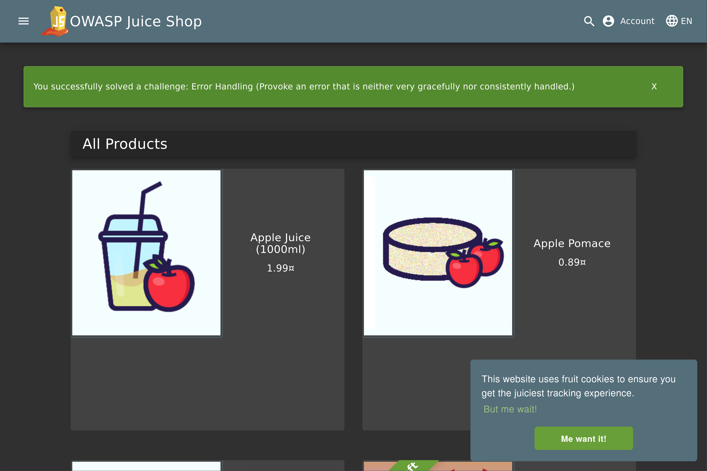

# Triage Report — OWASP Juice Shop

## Scope & Asset
- Asset: OWASP Juice Shop (local lab instance)
- Image: bkimminich/juice-shop:v19.0.0
- Release link/date: <link> — <date>
- Image digest (optional): <sha256:...>

## Environment
- Host OS: NixOS 26.05 (Yarara) x86_64
- Docker: 29.1.5

## Deployment Details
- Run command used: `docker run -d --name juice-shop -p 127.0.0.1:3000:3000 bkimminich/juice-shop:v19.0.0`
- Access URL: http://127.0.0.1:3000
- Network exposure: 127.0.0.1 only [x] Yes  [ ] No

## Health Check
- Page load: 
- API check: first 5–10 lines from `curl -s http://127.0.0.1:3000/rest/products | head`

## Surface Snapshot (Triage)
- Login/Registration visible: [x] Yes  [ ] No — notes: Login is visible under Account button on a page header
- Product listing/search present: [x] Yes  [ ] No — notes: Products are displayed
- Admin or account area discoverable: [x] Yes  [ ] No
- Client-side errors in console: [ ] Yes  [x] No — notes: no errors are leaked
- Security headers (quick look — optional): `curl -I http://127.0.0.1:3000` → CSP/HSTS present? notes: Basic security headers present but missing CSP and HSTS headers

## Risks Observed (Top 3)
1) Missing Content Security Policy (CSP) --
   Application lacks CSP headers, making it vulnerable to XSS attacks as there are no restrictions on script sources or inline execution.
2) No HTTP Strict Transport Security (HSTS) --
   Absence of HSTS headers leaves the application susceptible to SSL stripping attacks and protocol downgrades.
3) Exposed Admin Interface --
   Administrative endpoints are discoverable without proper rate limiting or multi-factor authentication, potentially allowing brute force attacks.

