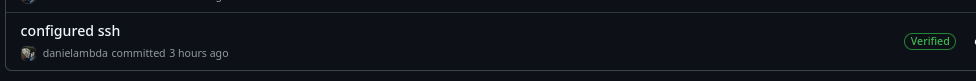
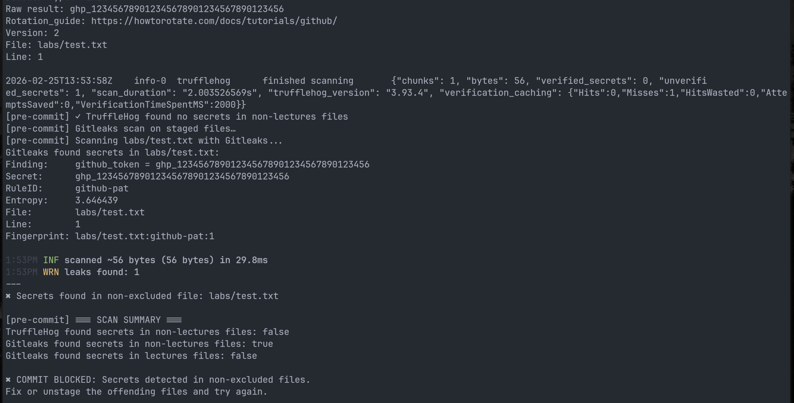

# Lab 3 — Secure Git Submission

## Task 1 — SSH Commit Signature Verification

### Summary of Commit Signing Benefits
Commit signing is like a digital fingerprint for your code. When you sign a commit with an SSH key, you're cryptographically proving that you—and only you—created that commit. The key benefits include:
- Authentication: Verifies that the commit actually came from you, not someone impersonating you
- Integrity: Guarantees the code hasn't been tampered with after you wrote it
- Trust: GitHub shows a nice green "Verified" badge
- Accountability: Creates a clear audit trail of who did what
- Professionalism: Shows you follow security best practices

### SSH Key Setup and Configuration

#### Step 1: Generate SSH Key

```bash
$ ssh-keygen -t ed25519 -C "your_email@example.com"
Generating public/private ed25519 key pair.
Enter file in which to save the key (/home/daniel/.ssh/id_ed25519):
Enter passphrase (empty for no passphrase):
Enter same passphrase again:
Your identification has been saved in /home/daniel/.ssh/id_ed25519
Your public key has been saved in /home/daniel/.ssh/id_ed25519.pub
```

#### Step 2: Add Public Key to GitHub
- Copied the public key: cat ~/.ssh/id_ed25519.pub
- Added to GitHub: Settings → SSH and GPG keys → New SSH Key

#### Step 3: Configure Git for SSH Signing

```bash
$ git config --global user.signingkey ~/.ssh/id_ed25519
$ git config --global commit.gpgSign true
$ git config --global gpg.format ssh

$ git config --global --list | grep -E "(gpg|signing)"
commit.gpgsign=true
gpg.format=ssh
user.signingkey=~/.ssh/id_ed25519
```

### Signed Commit Creation

#### Verified Badge Evidence:



After pushing to GitHub, my commit shows a green "Verified" badge, confirming:
- The SSH key on GitHub matches the one used to sign
- The commit content hasn't been altered
- The signature is cryptographically valid

### Analysis: Why is Commit Signing Critical in DevSecOps?

Commit signing is a fundamental security control in modern DevSecOps for several reasons:

1. Supply Chain Security
Attackers often target the development pipeline itself. Signed commits ensure that code entering your CI/CD pipeline hasn't been tampered with. If a commit isn't signed or the signature doesn't verify, you know something's wrong before it ever reaches production.

2. Trust in Automation
CI/CD systems can automatically verify signatures before building and deploying. This enables policies like "only deploy code signed by authorized developers." Without signatures, automation has no way to distinguish between legitimate code and malicious injections.

3. Audit and Compliance
In regulated industries, you need to prove who did what and when. Signed commits provide cryptographic proof that meets compliance requirements like SOC2, PCI-DSS, and FedRAMP.

4. Incident Response
When things go wrong, verified signatures help investigators distinguish between legitimate developer activity and potential attacks. If a commit isn't signed or verification fails, it's immediately suspect.

5. Zero Trust Architecture
"Never trust, always verify" applies to code too. Every commit should be verified before integration. With commit signing, you're treating every commit as potentially malicious until proven otherwise.

Without commit signing, anyone with push access could impersonate another developer, inject malicious code, and there would be no way to prove tampering occurred. In DevSecOps, where security is built into every step, commit signing is the foundation of code integrity.


## Task 2 – Pre‑commit Secret Scanning

### Hook Setup
- Hook file created at `.git/hooks/pre-commit` with the provided script.
- Made executable with `chmod +x`.
- Docker is required and was available.

### Testing Results

#### 1. Blocked commit (secret detected)
- Added `test.txt` containing fake github token
- Ran `git add test.txt` and `git commit -m "test secret"`.


### Analysis of Automated Secret Scanning
- Pre‑commit hooks run **before** a commit is created, so secrets never enter the local Git history.
- Tools like TruffleHog and Gitleaks use regex patterns and entropy analysis to detect credentials, API keys, and other sensitive strings.
- By integrating these tools into the development workflow, teams can catch accidental exposures early, reducing the risk of credentials being pushed to remote repositories.
- The hook also demonstrates how to **allow** certain directories (like `lectures/`) for educational purposes while still scanning the rest of the codebase.

